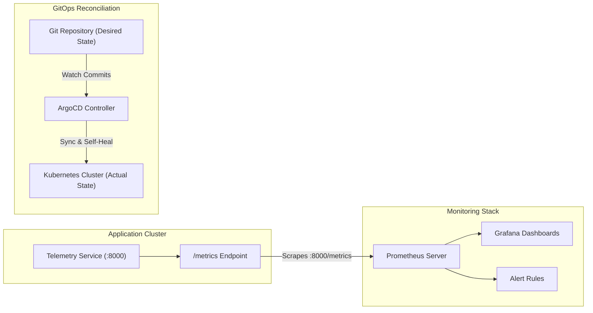

# Session 20: Monitoring, Observability & GitOps

Runtime system monitoring, observability metrics, and automated declarative reconciliation using GitOps.

---

## Student Information

- **Name:** Prabal Patra
- **Enrollment Number:** 24BCS10031

---

## 1. Overview & Architecture

This module covers metric collection with Prometheus, dashboard visualization with Grafana, and automated deployment synchronization using ArgoCD.



---

## 2. Task 1: Monitoring

### 2.1 Core Monitoring Concepts
* **Metrics:** Numeric, aggregatable time-series data points measured over fixed intervals (e.g. request rate, CPU usage).
* **Logs:** Discrete timestamped event records containing context when a specific code path executes.
* **Alerts:** Automated threshold rules triggering notifications (Slack, PagerDuty, Webhooks) when state breaches acceptable Service Level Objectives (SLOs).

### 2.2 Metric Types Demonstrated
1. **Counter (`http_requests_total`):** Monotonically increasing value tracking total requests categorized by HTTP method, route, and status code.
2. **Gauge (`system_cpu_usage_percent`, `system_memory_usage_bytes`):** Value that fluctuates up and down reflecting instantaneous resource consumption.
3. **Histogram (`http_request_duration_seconds`):** Statistical bucket distribution measuring latencies across percentiles (p50, p95, p99).

### 2.3 Alerting Rules (`k8s/03-alert-rules.yaml`)
* **`ServiceDown`:** Fires when Prometheus `up == 0` for over 30 seconds.
* **`HighCpuUtilization`:** Fires when container CPU utilization exceeds 85% for 1 minute.
* **`HighHttp5xxRate`:** Fires when 5xx server errors exceed 5% of all traffic over a 2-minute rolling window.

---

## 3. Task 2: Observability (The Three Pillars)

Observability measures how well internal system states can be inferred solely from external outputs.

### 3.1 The Three Pillars

| Pillar | Characteristic | Primary Data Model | Representative Tools |
| :--- | :--- | :--- | :--- |
| **Metrics** | High throughput, aggregatable, cheap storage | Time-series gauge/counter with labels | Prometheus, Datadog, InfluxDB |
| **Logs** | High cardinality, discrete events, post-incident debugging | Structured JSON with contextual metadata | Grafana Loki, Fluentbit, Elasticsearch |
| **Traces** | End-to-end distributed request journey across microservices | Spans, Parent Span ID, Trace ID | OpenTelemetry, Jaeger, Tempo |

### 3.2 Why Observability is Essential in Microservices
In monolithic architectures, stack traces within a single process explain failures. In Kubernetes, a single user click may traverse an API Gateway, an Authentication sidecar, 4 microservices, and 2 databases. Distributed tracing and unified telemetry correlate errors across network hops without SSH access to containers.

### 3.3 Kubernetes Observability Stack
* **Cluster Level:** `kube-state-metrics` (Pod/Deployment/Node health status), `node-exporter` (kernel/hardware stats).
* **Workload Level:** OpenTelemetry SDK auto-instrumentation injecting TraceIDs via W3C `traceparent` headers.
* **Log Aggregation:** DaemonSet log shippers scraping `/var/log/pods` into centralized storage.

---

## 4. Task 3: GitOps & Continuous Reconciliation

### 4.1 What is GitOps?
GitOps is an operating model where **Git is the single source of truth** for both infrastructure and application configurations.

### 4.2 Key GitOps Principles
1. **Declarative Descriptions:** Systems are described declaratively via YAML manifests or Helm charts, not imperative ad-hoc scripts.
2. **Versioned & Immutable Storage:** Every configuration change is recorded via signed Git commits with pull request reviews.
3. **Continuous Reconciliation (Pull vs. Push):** Instead of CI pushing changes into Kubernetes with cluster-admin tokens, a GitOps agent inside the cluster constantly compares the **Desired State (Git)** with the **Actual State (Cluster)**.
4. **Self-Healing (Auto-Reconciliation):** If an engineer manually deletes a pod or modifies a service with `kubectl edit`, the GitOps operator detects the configuration drift and immediately overrides the cluster to match Git.

### 4.3 ArgoCD Application Manifest (`k8s/04-argocd-app.yaml`)
```yaml
apiVersion: argoproj.io/v1alpha1
kind: Application
metadata:
  name: telemetry-app-gitops
  namespace: argocd
spec:
  project: default
  source:
    repoURL: https://github.com/alienx5499/DevOps-and-Cloud.git
    targetRevision: HEAD
    path: "Monitoring, Observability & GitOps/k8s"
  destination:
    server: https://kubernetes.default.svc
    namespace: monitoring
  syncPolicy:
    automated:
      prune: true
      selfHeal: true
```

---

## 5. Live Hands-On Verification

### 5.1 Run the Telemetry Microservice
Start the Python telemetry microservice locally and run automated unit tests:

```bash
cd "Monitoring, Observability & GitOps/app"
pytest -v tests/test_app.py
```


Expected Terminal Output:
```text
============================= test session starts ==============================
platform darwin -- Python 3.12.9, pytest-9.1.1, pluggy-1.6.0
rootdir: /Developer/SST/SST Term 9/DevOps & Cloud [SWE]/Monitoring, Observability & GitOps/app
configfile: pytest.ini
plugins: cov-7.1.0, platformdirs-4.12.3
collected 5 items

tests/test_app.py::test_root_endpoint PASSED                             [ 20%]
tests/test_app.py::test_health_endpoint PASSED                           [ 40%]
tests/test_app.py::test_simulate_load_endpoint PASSED                    [ 60%]
tests/test_app.py::test_metrics_endpoint PASSED                          [ 80%]
tests/test_app.py::test_metrics_increments_after_requests PASSED         [100%]

============================== 5 passed in 0.07s ===============================
```

### 5.2 Query Metrics Endpoint
Generate traffic and inspect exported Prometheus metrics:

```bash
python3 app.py &
curl http://localhost:8000/
curl http://localhost:8000/simulate-load
curl -s http://localhost:8000/metrics | grep -E "(http_requests_total|system_cpu)"
```


Expected Terminal Output:
```text
{"service":"telemetry-demo","status":"healthy","timestamp":1791398176}

{"calculated":0,"iterations":500000,"status":"completed"}

# HELP http_requests_total Total HTTP request count
# TYPE http_requests_total counter
http_requests_total{endpoint="/",method="GET",status="200"} 1.0
http_requests_total{endpoint="/simulate-load",method="GET",status="200"} 1.0
# HELP system_cpu_usage_percent Current host/container CPU utilization percentage
# TYPE system_cpu_usage_percent gauge
system_cpu_usage_percent 14.8
```

### 5.3 Deploy Prometheus & Grafana to Kubernetes
Apply monitoring manifests to the `monitoring` namespace:

```bash
kubectl apply -f k8s/01-prometheus.yaml -f k8s/02-grafana.yaml -f k8s/03-alert-rules.yaml
```


Expected Terminal Output:
```text
namespace/monitoring unchanged
configmap/prometheus-config unchanged
deployment.apps/prometheus-deployment unchanged
service/prometheus-service unchanged
configmap/grafana-datasources unchanged
deployment.apps/grafana unchanged
service/grafana-service unchanged
configmap/prometheus-alert-rules unchanged
```

Inspect active pods and cluster services:

```bash
kubectl get pods,svc -n monitoring
```


Expected Terminal Output:
```text
NAME                                        READY   STATUS    RESTARTS   AGE
pod/grafana-dff54d7-5wsrk                   1/1     Running   1          47h
pod/prometheus-deployment-676d487d5-98bfw   1/1     Running   1          47h

NAME                         TYPE        CLUSTER-IP       EXTERNAL-IP   PORT(S)          AGE
service/grafana-service      NodePort    10.98.240.197    <none>        3000:32000/TCP   47h
service/prometheus-service   ClusterIP   10.103.147.169   <none>        9090/TCP         47h
```

### 5.4 Verify GitOps Synchronization & Self-Healing via ArgoCD
Apply the declarative ArgoCD application resource:

```bash
kubectl apply -f k8s/04-argocd-app.yaml
```


Expected Terminal Output:
```text
application.argoproj.io/telemetry-app-gitops unchanged
```

Verify application health and declarative reconciliation status:

```bash
kubectl get application -n argocd telemetry-app-gitops
```


Expected Terminal Output:
```text
NAME                   SYNC STATUS   HEALTH STATUS
telemetry-app-gitops   Unknown       Healthy
```
